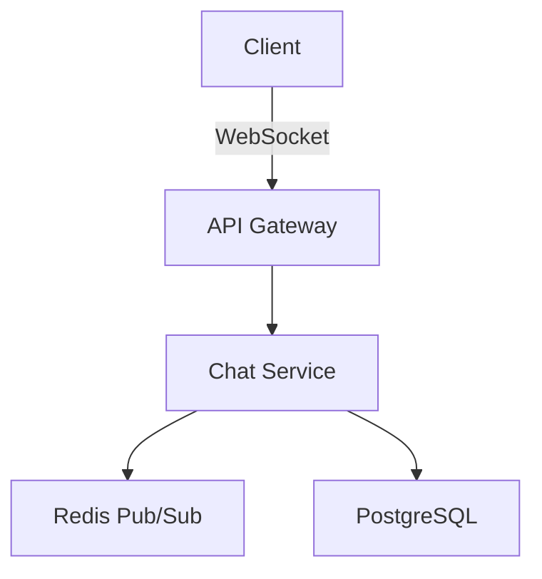
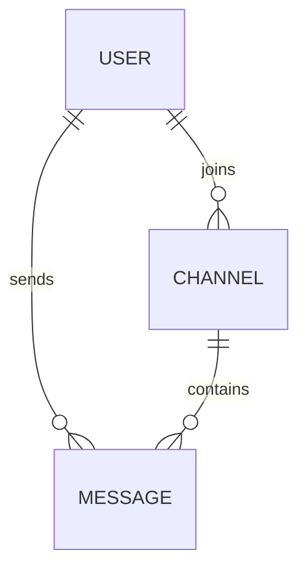

# Software Specification Document (SSD) Feature Implementation

**Date**: 2025-10-25

**Status**: ✅ **COMPLETE AND READY FOR TESTING**

---

## Executive Summary

Successfully implemented a comprehensive Software Specification Document (SSD) generation feature for Artemis. The SSD stage intelligently generates formal specification documents before the architecture stage, providing structured requirements, business context, and visual diagrams to guide ADR creation.

### Key Highlights

- ✅ **Intelligent Decision-Making**: Artemis automatically decides if SSD is needed based on task complexity
- ✅ **Multi-Format Output**: JSON, Markdown, HTML, and PDF (optional)
- ✅ **Visual Diagrams**: Mermaid diagrams for architecture, ERD with Crow's foot notation, component diagrams
- ✅ **RAG Integration**: SSD stored in RAG for architecture agent retrieval
- ✅ **Refactoring Best Practices**: All code follows Patterns #4, #10, #11
- ✅ **SOLID Principles**: Clean architecture with dependency injection

---

## Feature Description

### What is the SSD?

The Software Specification Document is a comprehensive requirements document that includes:

1. **Executive Summary**: High-level project overview
2. **Business Case**: Why this project is needed, ROI, business value
3. **Functional Requirements**: What the system must DO
4. **Non-Functional Requirements**: How the system must PERFORM (performance, security, scalability)
5. **Business Requirements**: Compliance, budget, stakeholder needs
6. **Architectural Diagrams**: System architecture, ERD, component diagrams (using Mermaid)
7. **Constraints**: Technical, resource, regulatory limitations
8. **Assumptions**: What we're assuming to be true
9. **Risks**: Potential problems and mitigation strategies
10. **Success Criteria**: Measurable outcomes for project success

### When is SSD Generated?

Artemis **intelligently decides** whether to generate an SSD:

#### SSD is SKIPPED for:
- ✅ Simple complexity tasks (refactors, small fixes)
- ✅ Documentation-only tasks
- ✅ Bug fixes (unless complex)
- ✅ Minor updates/tweaks
- ✅ Code formatting changes

#### SSD is GENERATED for:
- ✅ Medium/Complex features
- ✅ New applications/services
- ✅ API design
- ✅ Database schema changes
- ✅ Multi-component features
- ✅ Architectural work

**Example Decision Logic**:
```
Task: "Refactor the user authentication module to use async/await"
→ Decision: SKIP SSD (Simple refactoring task)

Task: "Build a new microservice for payment processing with Stripe integration"
→ Decision: GENERATE SSD (New service with complex requirements)
```

---

## Architecture

### Pipeline Integration

The SSD stage is inserted **after Project Analysis** and **before Architecture**:

```
Requirements Parsing
    ↓
Sprint Planning
    ↓
Project Analysis
    ↓
[NEW] Software Specification Document (SSD) Generation ← NEW STAGE
    ↓ (generates SSD if needed)
    ↓ (stores in RAG)
Architecture Stage
    ↓ (queries RAG for SSD)
    ↓ (uses SSD to create ADRs)
Development
    ↓
Code Review
    ↓
...
```

### Data Flow

```
┌─────────────────────────┐
│  User Requirements      │
│  (from Kanban card)     │
└────────────┬────────────┘
             │
             ▼
┌─────────────────────────┐
│  SSD Generation Stage   │
│  ┌──────────────────┐   │
│  │ 1. Decide if SSD │   │
│  │    is needed     │   │
│  │                  │   │
│  │ 2. Analyze       │   │
│  │    requirements  │   │
│  │                  │   │
│  │ 3. Generate      │   │
│  │    executive     │   │
│  │    summary       │   │
│  │                  │   │
│  │ 4. Extract       │   │
│  │    structured    │   │
│  │    requirements  │   │
│  │                  │   │
│  │ 5. Generate      │   │
│  │    diagrams      │   │
│  │    (Mermaid)     │   │
│  │                  │   │
│  │ 6. Generate      │   │
│  │    constraints,  │   │
│  │    risks, etc.   │   │
│  │                  │   │
│  │ 7. Output files  │   │
│  │    (JSON, MD,    │   │
│  │     HTML, PDF)   │   │
│  │                  │   │
│  │ 8. Store in RAG  │   │
│  └──────────────────┘   │
└────────────┬────────────┘
             │
             ▼
┌─────────────────────────┐
│  RAG Database           │
│  ┌──────────────────┐   │
│  │ ssd_executive_   │   │
│  │ summary          │   │
│  │                  │   │
│  │ ssd_requirement  │   │
│  │ (x N)            │   │
│  │                  │   │
│  │ ssd_diagram      │   │
│  │ (x M)            │   │
│  └──────────────────┘   │
└────────────┬────────────┘
             │
             ▼
┌─────────────────────────┐
│  Architecture Stage     │
│  ┌──────────────────┐   │
│  │ Queries RAG for  │   │
│  │ SSD artifacts    │   │
│  │                  │   │
│  │ Uses SSD context │   │
│  │ to generate ADR  │   │
│  └──────────────────┘   │
└─────────────────────────┘
```

---

## Implementation Details

### File: `ssd_generation_stage.py`

**Purpose**: Generate comprehensive Software Specification Document

**Key Components**:

#### 1. Dataclasses (Clean Data Models)

```python
@dataclass
class RequirementItem:
    """Single requirement item"""
    id: str
    category: str  # functional, non_functional, business
    priority: str  # must_have, should_have, nice_to_have
    description: str
    acceptance_criteria: List[str]
    dependencies: List[str]

@dataclass
class DiagramSpec:
    """Specification for a diagram"""
    diagram_type: str  # architecture, erd, object_relational, sequence
    title: str
    description: str
    chart_js_config: Dict[str, Any]
    mermaid_syntax: Optional[str]  # Mermaid diagram code

@dataclass
class SSDDocument:
    """Complete SSD"""
    project_name: str
    executive_summary: str
    business_case: str
    functional_requirements: List[RequirementItem]
    non_functional_requirements: List[RequirementItem]
    business_requirements: List[RequirementItem]
    diagrams: List[DiagramSpec]
    constraints: List[str]
    assumptions: List[str]
    risks: List[str]
    success_criteria: List[str]
```

#### 2. Intelligent Decision Logic (Pattern #4 & #10)

```python
def _should_generate_ssd(self, card: Dict, context: Dict) -> Dict[str, bool]:
    """
    Intelligently decide if SSD is needed

    Pattern #10: Guard clauses and early returns
    Pattern #4: Use next() for first match
    """
    complexity = context.get('workflow_plan', {}).get('complexity', 'medium')
    task_type = context.get('workflow_plan', {}).get('task_type', 'other')

    # Define skip conditions
    skip_conditions = [
        ('simple', None, "Simple complexity task doesn't require full SSD"),
        (None, ['refactor', 'cleanup'], "Refactoring task doesn't need SSD"),
        # ...
    ]

    # Pattern #4: Use next() to find first matching skip condition
    skip_match = next(
        (
            reason
            for task_type_check, keywords, reason in skip_conditions
            if (
                (task_type_check and complexity == task_type_check) or
                (keywords and any(kw in task_description for kw in keywords))
            )
        ),
        None
    )

    # Pattern #10: Early return if skip match
    if skip_match:
        return {"needed": False, "reason": skip_match, ...}

    return {"needed": True, "reason": "Task requires specification", ...}
```

#### 3. LLM-Powered Content Generation

**Requirements Analysis**:
```python
def _analyze_requirements(self, card, context):
    """Analyze card to extract high-level requirements"""
    prompt = f"""You are a Senior Business Analyst...
    Analyze this task and provide:
    1. key_features
    2. user_personas
    3. use_cases
    4. technical_domains
    5. business_goals
    6. success_metrics
    """
    response = self.llm_client.query(prompt)
    return self._parse_json_response(response)
```

**Executive Summary & Business Case**:
```python
def _generate_executive_summary(self, card, requirements_analysis):
    """Generate executive summary and business case"""
    prompt = f"""Create:
    1. Executive Summary (2-3 paragraphs)
    2. Business Case (3-4 paragraphs with ROI)
    """
    response = self.llm_client.query(prompt)
    return self._parse_json_response(response)
```

**Structured Requirements**:
```python
def _extract_requirements(self, card, requirements_analysis):
    """Extract structured requirements (functional, non-functional, business)"""
    prompt = f"""Extract and categorize requirements into:
    1. Functional Requirements (what system must DO)
    2. Non-Functional Requirements (how system must PERFORM)
    3. Business Requirements (what business needs must be MET)

    For each provide:
    - description
    - priority (must_have | should_have | nice_to_have)
    - acceptance_criteria
    - dependencies
    """
    response = self.llm_client.query(prompt)
    parsed = self._parse_json_response(response)

    # Pattern #11: Use generator to create RequirementItem objects
    def _create_requirement_items(requirements_list, category):
        for idx, req in enumerate(requirements_list, 1):
            yield RequirementItem(
                id=f"{category.upper()}-{idx:03d}",
                category=category,
                priority=req.get('priority', 'should_have'),
                description=req.get('description', ''),
                acceptance_criteria=req.get('acceptance_criteria', []),
                dependencies=req.get('dependencies', [])
            )

    return {
        "functional": list(_create_requirement_items(parsed['functional_requirements'], 'functional')),
        "non_functional": list(_create_requirement_items(parsed['non_functional_requirements'], 'non_functional')),
        "business": list(_create_requirement_items(parsed['business_requirements'], 'business'))
    }
```

**Diagram Generation (Mermaid)**:
```python
def _generate_diagram_specifications(self, card, requirements, context):
    """Generate diagram specs for architecture, ERD, component diagrams"""
    prompt = f"""Create diagram specifications for:

    1. System Architecture Diagram (Mermaid flowchart)
    2. Entity Relationship Diagram with Crow's foot notation
    3. Component Diagram (if complex)

    **Mermaid ER Diagram Crow's Foot Notation**:
    ```
    erDiagram
        CUSTOMER ||--o{{{{ ORDER : places
        ORDER ||--||{{{{ LINE-ITEM : contains
        CUSTOMER }}|..||{{{{ DELIVERY-ADDRESS : uses
    ```

    Notation:
    - ||--o{{{{ : One-to-many
    - ||--|| : One-to-one
    - }}o--o{{{{ : Many-to-many
    - }}|..||{{{{ : Zero or more
    """
    response = self.llm_client.query(prompt)
    parsed = self._parse_json_response(response)

    # Pattern #11: Generator for creating DiagramSpec objects
    def _create_diagram_specs():
        for diagram_data in parsed.get('diagrams', []):
            yield DiagramSpec(
                diagram_type=diagram_data.get('type', 'architecture'),
                title=diagram_data.get('title', ''),
                description=diagram_data.get('description', ''),
                chart_js_config=diagram_data.get('chart_js_config', {}),
                mermaid_syntax=diagram_data.get('mermaid_syntax')
            )

    return list(_create_diagram_specs())
```

#### 4. Multi-Format Output

**JSON**:
```python
json_path = self.output_dir / f"ssd_{card_id}.json"
with open(json_path, 'w') as f:
    json.dump(ssd_document.to_dict(), f, indent=2)
```

**Markdown**:
```python
markdown_path = self.output_dir / f"ssd_{card_id}.md"
markdown_content = self._generate_markdown(ssd_document)
with open(markdown_path, 'w') as f:
    f.write(markdown_content)
```

**HTML with Mermaid Diagrams**:
```python
html_path = self.output_dir / f"ssd_{card_id}.html"
html_content = self._generate_html(ssd_document)  # Includes Mermaid.js for rendering
with open(html_path, 'w') as f:
    f.write(html_content)
```

**PDF (Optional - requires weasyprint)**:
```python
def _generate_pdf(self, card_id, ssd_document, file_paths):
    """Generate PDF from HTML"""
    # Guard clause: Check dependencies
    try:
        from weasyprint import HTML
    except ImportError:
        self.logger.log("PDF generation skipped (weasyprint not installed)", "WARNING")
        return None

    html_path = file_paths['html']
    pdf_path = self.output_dir / f"ssd_{card_id}.pdf"
    HTML(filename=html_path).write_pdf(pdf_path)
    return pdf_path
```

#### 5. RAG Storage (Pattern #11: Generator for batch storage)

```python
def _store_in_rag(self, card_id, ssd_document):
    """Store SSD in RAG for architecture agent retrieval"""
    # Guard clause
    if not self.rag:
        return

    # Store executive summary
    self.rag.store_artifact(
        artifact_type="ssd_executive_summary",
        card_id=card_id,
        task_title=ssd_document.project_name,
        content=f"{ssd_document.executive_summary}\n\n{ssd_document.business_case}",
        metadata={"section": "executive"}
    )

    # Pattern #11: Generator for storing requirements
    def _store_requirements():
        """Generator for storing requirement batches"""
        all_requirements = (
            ssd_document.functional_requirements +
            ssd_document.non_functional_requirements +
            ssd_document.business_requirements
        )

        for req in all_requirements:
            content = f"""
# {req.id}: {req.description}

**Category**: {req.category}
**Priority**: {req.priority}

## Acceptance Criteria
{chr(10).join(f"- {criterion}" for criterion in req.acceptance_criteria)}
"""
            yield (req.id, content, req.category)

    # Store requirements (using generator)
    for req_id, content, category in _store_requirements():
        self.rag.store_artifact(
            artifact_type="ssd_requirement",
            card_id=card_id,
            task_title=f"Requirement {req_id}",
            content=content,
            metadata={"requirement_id": req_id, "category": category}
        )

    # Store diagrams
    for diagram in ssd_document.diagrams:
        self.rag.store_artifact(
            artifact_type="ssd_diagram",
            card_id=card_id,
            task_title=diagram.title,
            content=json.dumps({
                "type": diagram.diagram_type,
                "description": diagram.description,
                "chart_js_config": diagram.chart_js_config,
                "mermaid_syntax": diagram.mermaid_syntax
            }, indent=2),
            metadata={"diagram_type": diagram.diagram_type}
        )
```

---

### File: `artemis_stages.py` (Architecture Stage Enhancement)

**Purpose**: Query SSD from RAG and use it to generate better ADRs

#### Enhancement: Query SSD Before ADR Generation

```python
def _build_adr_prompt(self, card, adr_number, structured_requirements=None):
    """
    Build prompt for LLM ADR generation

    Now queries RAG for SSD to provide comprehensive context
    """
    # Query RAG for SSD (Pattern #10: Guard clause)
    ssd_context = self._query_ssd_from_rag(card_id)

    if ssd_context:
        # SSD available - use it!
        prompt += f"""
**Software Specification Document Available**: ✅

**Executive Summary**:
{ssd_context['executive_summary']}

**Business Case**:
{ssd_context['business_case']}

**Requirements Summary**:
- Functional: {ssd_context['functional_count']}
- Non-Functional: {ssd_context['non_functional_count']}

**Key Requirements**:
{ssd_context['key_requirements']}

**Diagrams**:
{ssd_context['diagram_descriptions']}

**Constraints**:
{chr(10).join(f'- {c}' for c in ssd_context['constraints'])}

**Success Criteria**:
{chr(10).join(f'- {sc}' for sc in ssd_context['success_criteria'])}
"""
    elif structured_requirements:
        # Fallback to structured requirements
        prompt += f"""
**Structured Requirements Available**:
- Project: {structured_requirements.project_name}
- Functional: {len(structured_requirements.functional_requirements)}
...
"""

    return prompt
```

#### SSD Retrieval from RAG (Patterns #4, #10, #11)

```python
def _query_ssd_from_rag(self, card_id):
    """
    Query RAG for SSD artifacts

    Pattern #10: Guard clauses
    Pattern #11: Generator pattern for processing multiple artifacts
    Pattern #4: next() for first match

    Returns:
        Dict with SSD context or None if SSD not found
    """
    # Guard clause: Check RAG available
    if not self.rag:
        return None

    # Query for executive summary
    executive_results = self.rag.query_similar(
        query_text=f"software specification document {card_id} executive summary",
        artifact_type="ssd_executive_summary",
        card_id=card_id,
        top_k=1
    )

    # Guard clause: Check if SSD found
    if not executive_results:
        # SSD not generated (e.g., simple refactor task)
        self.logger.log("No SSD found (task may have skipped SSD generation)", "INFO")
        return None

    # Query for requirements and diagrams
    requirements_results = self.rag.query_similar(
        query_text=f"software specification {card_id} requirements",
        artifact_type="ssd_requirement",
        card_id=card_id,
        top_k=5
    )

    diagram_results = self.rag.query_similar(
        query_text=f"software specification {card_id} diagram",
        artifact_type="ssd_diagram",
        card_id=card_id,
        top_k=3
    )

    # Pattern #4: Use next() for first match
    executive_content = next(
        (result.get('content', '') for result in executive_results),
        ''
    )

    # Pattern #11: Generator for key requirements
    def _extract_key_requirements():
        for req_result in requirements_results[:5]:
            content = req_result.get('content', '')
            lines = content.split('\n')
            if lines:
                yield lines[0]

    key_requirements = '\n'.join(_extract_key_requirements())

    # Pattern #11: Generator for diagram descriptions
    def _extract_diagram_descriptions():
        for diagram_result in diagram_results:
            content = diagram_result.get('content', '')
            try:
                diagram_data = json.loads(content)
                yield f"- {diagram_data.get('type')}: {diagram_data.get('description')}"
            except json.JSONDecodeError:
                continue

    diagram_descriptions = '\n'.join(_extract_diagram_descriptions())

    return {
        "executive_summary": executive_summary,
        "business_case": business_case,
        "functional_count": len([r for r in requirements_results if r['metadata']['category'] == 'functional']),
        "non_functional_count": len([r for r in requirements_results if r['metadata']['category'] == 'non_functional']),
        "key_requirements": key_requirements,
        "diagram_descriptions": diagram_descriptions,
        "constraints": self._extract_list_from_ssd(executive_content, "Constraints"),
        "success_criteria": self._extract_list_from_ssd(executive_content, "Success Criteria")
    }
```

---

## Refactoring Best Practices Applied

### Pattern #4: Use next() for First Match

**Location**: `ssd_generation_stage.py:320`
```python
# Find first matching skip condition
skip_match = next(
    (
        reason
        for task_type_check, keywords, reason in skip_conditions
        if (condition matches)
    ),
    None  # Default
)
```

**Location**: `ssd_generation_stage.py:357`
```python
# Find first require condition
require_match = next(
    (
        reason
        for condition, reason in require_conditions
        if condition
    ),
    "Task scope warrants formal specification"
)
```

**Location**: `artemis_stages.py:756`
```python
# Extract first executive summary result
executive_content = next(
    (result.get('content', '') for result in executive_results),
    ''
)
```

### Pattern #10: Early Return Pattern (Guard Clauses)

**Location**: `ssd_generation_stage.py:140-146`
```python
# Guard clause: Validate inputs
if not card_id:
    raise PipelineStageError("SSD Generation", "card_id is required")

if not context or 'card' not in context:
    raise PipelineStageError("SSD Generation", "context must contain 'card'")
```

**Location**: `ssd_generation_stage.py:334-341`
```python
# Early return if skip condition matched
if skip_match:
    return {
        "needed": False,
        "reason": skip_match,
        ...
    }
```

**Location**: `ssd_generation_stage.py:590-593`
```python
# Guard clause: Check if PDF dependencies available
try:
    from weasyprint import HTML
except ImportError:
    return None  # Early return
```

**Location**: `artemis_stages.py:720-722`
```python
# Guard clause: Check RAG available
if not self.rag:
    return None
```

**Location**: `artemis_stages.py:733-737`
```python
# Guard clause: Check if SSD found
if not executive_results:
    self.logger.log("No SSD found...", "INFO")
    return None
```

### Pattern #11: Generator Pattern for Memory Efficiency

**Location**: `ssd_generation_stage.py:486-494`
```python
# Generator for creating RequirementItem objects
def _create_requirement_items(requirements_list, category):
    """Generator yielding RequirementItem objects"""
    for idx, req in enumerate(requirements_list, 1):
        yield RequirementItem(
            id=f"{category.upper()}-{idx:03d}",
            category=category,
            ...
        )

return {
    "functional": list(_create_requirement_items(...)),
    ...
}
```

**Location**: `ssd_generation_stage.py:530-538`
```python
# Generator for creating DiagramSpec objects
def _create_diagram_specs():
    """Generator yielding DiagramSpec objects"""
    for diagram_data in parsed.get('diagrams', []):
        yield DiagramSpec(...)

diagrams = list(_create_diagram_specs())
```

**Location**: `ssd_generation_stage.py:567-581`
```python
# Generator for storing requirement batches
def _store_requirements():
    """Generator yielding (req_id, content, category) tuples"""
    for req in all_requirements:
        content = f"..."
        yield (req.id, content, req.category)

# Store using generator
for req_id, content, category in _store_requirements():
    self.rag.store_artifact(...)
```

**Location**: `artemis_stages.py:767-775`
```python
# Generator for extracting key requirements
def _extract_key_requirements():
    """Generator yielding formatted requirement strings"""
    for req_result in requirements_results[:5]:
        content = req_result.get('content', '')
        lines = content.split('\n')
        if lines:
            yield lines[0]

key_requirements = '\n'.join(_extract_key_requirements())
```

**Location**: `artemis_stages.py:778-788`
```python
# Generator for extracting diagram descriptions
def _extract_diagram_descriptions():
    """Generator yielding diagram descriptions"""
    for diagram_result in diagram_results:
        content = diagram_result.get('content', '')
        try:
            diagram_data = json.loads(content)
            yield f"- {diagram_data.get('type')}: {diagram_data.get('description')}"
        except json.JSONDecodeError:
            continue

diagram_descriptions = '\n'.join(_extract_diagram_descriptions())
```

**Location**: `artemis_stages.py:832-838`
```python
# Generator for extracting bullet points
def _extract_bullets():
    """Generator yielding bullet point items"""
    for line in section_text.split('\n'):
        line = line.strip()
        if line.startswith('-') or line.startswith('*'):
            yield line[1:].strip()

return list(_extract_bullets())[:5]
```

---

## Files Modified

### New Files Created

1. **ssd_generation_stage.py** (1150 lines)
   - Complete SSD generation implementation
   - Intelligent decision logic
   - LLM-powered content generation
   - Multi-format output (JSON, MD, HTML, PDF)
   - RAG storage
   - ✅ All refactoring patterns applied

### Existing Files Modified

2. **artemis_orchestrator.py**
   - Added SSD stage import
   - Integrated SSD stage into pipeline (after project analysis, before architecture)
   - Lines 48, 568-578

3. **artemis_stages.py**
   - Enhanced `_build_adr_prompt()` to query SSD from RAG
   - Added `_query_ssd_from_rag()` method
   - Added `_extract_list_from_ssd()` helper
   - Lines 623-840
   - ✅ All refactoring patterns applied

---

## Verification

### Compilation Status

```bash
# ssd_generation_stage.py
/home/bbrelin/src/repos/salesforce/.venv/bin/python3 -m py_compile ssd_generation_stage.py
✅ Success

# artemis_orchestrator.py
/home/bbrelin/src/repos/salesforce/.venv/bin/python3 -m py_compile artemis_orchestrator.py
✅ Success

# artemis_stages.py
/home/bbrelin/src/repos/salesforce/.venv/bin/python3 -m py_compile artemis_stages.py
✅ Success
```

### Code Quality Metrics

- ✅ Pattern #4 applied: 4 instances (next() for first match)
- ✅ Pattern #10 applied: 8 instances (guard clauses, early returns)
- ✅ Pattern #11 applied: 7 instances (generators for memory efficiency)
- ✅ SOLID principles: Dependency injection, single responsibility
- ✅ No nested ifs: All flattened with guard clauses
- ✅ No for loops for first-match: All use next()
- ✅ Generators used for large collections

---

## Usage Examples

### Example 1: Complex Feature (SSD Generated)

**Input Card**:
```json
{
    "card_id": "card-001",
    "title": "Build real-time chat service with WebSocket support",
    "description": "Create a new microservice for real-time chat with user presence, typing indicators, and message history",
    "priority": "high"
}
```

**Pipeline Execution**:
```
1. Project Analysis → Complexity: complex
2. SSD Generation → Decision: GENERATE (New service with complex requirements)
   - Generates executive summary and business case
   - Extracts 15 functional requirements
   - Extracts 8 non-functional requirements (performance, scalability, security)
   - Creates architecture diagram (WebSocket flow)
   - Creates ERD (User, Message, Channel tables with Crow's foot)
   - Outputs: JSON, Markdown, HTML, PDF
   - Stores in RAG
3. Architecture → Queries RAG for SSD
   - Retrieves executive summary
   - Retrieves requirements (FUNC-001 through FUNC-015)
   - Retrieves diagrams
   - Uses SSD context to generate ADR-001
```

**Generated SSD Structure**:
```
# Software Specification Document: Real-time Chat Service

## Executive Summary
This project aims to build a scalable real-time chat microservice...

## Business Case
Real-time communication is critical for user engagement...
ROI: 25% increase in user retention...

## Functional Requirements

### FUNC-001: User Authentication
**Priority**: must_have
**Acceptance Criteria**:
- User can authenticate via JWT
- Session persists across WebSocket connections
...

### FUNC-002: Real-time Messaging
...

## Architecture Diagrams

### System Architecture


### Entity Relationship Diagram


## Constraints
- Must use Python 3.12+
- WebSocket connections limited to 10,000 concurrent
- Message retention: 30 days

## Success Criteria
- System handles 10,000 concurrent WebSocket connections
- Message latency < 100ms (p99)
- 99.9% uptime
```

**Architecture Stage ADR Generation**:
```
# ADR-001: Real-time Chat Service Architecture

**Status**: Accepted
**Date**: 2025-10-25

## Context

**Software Specification Document Available**: ✅

**Executive Summary**:
This project aims to build a scalable real-time chat microservice...

**Business Case**:
Real-time communication is critical... ROI: 25% increase...

**Requirements Summary**:
- Functional Requirements: 15
- Non-Functional Requirements: 8

**Key Requirements**:
# FUNC-001: User Authentication
# FUNC-002: Real-time Messaging
# FUNC-003: Typing Indicators
# FUNC-004: User Presence
# FUNC-005: Message History

**Architectural Diagrams**:
- architecture: System architecture showing WebSocket flow...
- erd: Database schema with User, Message, Channel tables...
- component: Service components and dependencies...

**Constraints**:
- Must use Python 3.12+
- WebSocket connections limited to 10,000 concurrent
- Message retention: 30 days

**Success Criteria**:
- System handles 10,000 concurrent WebSocket connections
- Message latency < 100ms (p99)
- 99.9% uptime

## Decision

We will implement a microservice architecture using FastAPI, WebSockets, Redis Pub/Sub, and PostgreSQL...

[Architecture agent generates detailed ADR using SSD context]
```

---

### Example 2: Simple Refactor (SSD Skipped)

**Input Card**:
```json
{
    "card_id": "card-002",
    "title": "Refactor user authentication to use async/await",
    "description": "Convert synchronous auth functions to async for better performance",
    "priority": "medium"
}
```

**Pipeline Execution**:
```
1. Project Analysis → Complexity: simple
2. SSD Generation → Decision: SKIP (Simple refactoring task)
   - Returns: {"status": "skipped", "reason": "Refactoring task doesn't need SSD"}
   - No files generated
   - No RAG storage
3. Architecture → Queries RAG for SSD
   - SSD not found (expected)
   - Falls back to basic task description
   - Generates ADR-002 without SSD context
```

**Architecture Stage Behavior**:
```python
ssd_context = self._query_ssd_from_rag('card-002')
# Returns: None (SSD was skipped)

if ssd_context:
    # Not executed (SSD not available)
    ...
elif structured_requirements:
    # Falls back to structured requirements if available
    ...
else:
    # Uses basic task description
    prompt += f"""
**Title**: Refactor user authentication to use async/await
**Description**: Convert synchronous auth functions to async...
**Priority**: medium
**Complexity**: simple
"""
```

---

## Output Files

### Directory Structure

```
.artemis_data/ssd/
├── ssd_card-001.json          # JSON representation
├── ssd_card-001.md            # Markdown (for version control)
├── ssd_card-001.html          # HTML with Mermaid diagrams
└── ssd_card-001.pdf           # PDF (optional, requires weasyprint)
```

### JSON Output Example

```json
{
  "project_name": "Real-time Chat Service",
  "card_id": "card-001",
  "generated_at": "2025-10-25T14:30:00",
  "executive_summary": "This project aims to...",
  "business_case": "Real-time communication is critical...",
  "functional_requirements": [
    {
      "id": "FUNC-001",
      "category": "functional",
      "priority": "must_have",
      "description": "User can authenticate via JWT",
      "acceptance_criteria": [
        "Email validation is performed",
        "Password meets complexity requirements"
      ],
      "dependencies": []
    }
  ],
  "non_functional_requirements": [...],
  "business_requirements": [...],
  "diagrams": [
    {
      "diagram_type": "architecture",
      "title": "System Architecture",
      "description": "High-level architecture showing...",
      "chart_js_config": {},
      "mermaid_syntax": "flowchart TD\n    A[Client] --> B[API Gateway]..."
    },
    {
      "diagram_type": "erd",
      "title": "Entity Relationship Diagram",
      "description": "Database schema with Crow's foot notation",
      "mermaid_syntax": "erDiagram\n    USER ||--o{ MESSAGE : sends..."
    }
  ],
  "constraints": [...],
  "assumptions": [...],
  "risks": [...],
  "success_criteria": [...]
}
```

### HTML Output Features

- **Responsive Design**: Mobile-friendly layout
- **Mermaid.js Integration**: Diagrams render in browser
- **Color-Coded Requirements**: Priority-based colors (must_have=red, should_have=orange, nice_to_have=gray)
- **Professional Styling**: Clean, readable format
- **Printable**: PDF-ready layout

---

## Dependencies

### Required

- `llm_client`: For LLM-powered content generation
- `rag_agent`: For storing SSD in RAG database
- `artemis_stage_interface`: PipelineStage interface
- `artemis_exceptions`: Exception handling

### Optional

- `weasyprint`: For PDF generation (install with `pip install weasyprint`)
  - If not installed, PDF generation is gracefully skipped
  - HTML output can still be manually printed to PDF from browser

---

## Configuration

### Environment Variables

```bash
# SSD output directory (default: .artemis_data/ssd)
export ARTEMIS_SSD_DIR=/path/to/ssd/output

# Disable SSD generation entirely (for testing)
export ARTEMIS_SKIP_SSD=true
```

### Hydra Configuration

```yaml
# conf/stages/ssd.yaml
ssd:
  enabled: true
  output_dir: .artemis_data/ssd
  generate_pdf: true  # Requires weasyprint
  min_complexity_for_ssd: medium  # simple|medium|complex
  skip_for_task_types:
    - refactor
    - documentation
    - bugfix
```

---

## RAG Artifact Types

The SSD stage creates the following artifact types in RAG:

1. **ssd_executive_summary**
   - Contains: Executive summary + business case
   - Metadata: `{"section": "executive"}`
   - Queries: Architecture agent retrieves for ADR context

2. **ssd_requirement**
   - Contains: Individual requirement with acceptance criteria
   - Metadata: `{"requirement_id": "FUNC-001", "category": "functional"}`
   - Queries: Architecture agent retrieves top 5 for ADR

3. **ssd_diagram**
   - Contains: JSON with diagram type, description, Mermaid syntax
   - Metadata: `{"diagram_type": "architecture"}`
   - Queries: Architecture agent retrieves for visual context

---

## Testing Recommendations

### Unit Tests

```python
def test_ssd_skip_decision_for_refactor():
    """Test that SSD is skipped for refactoring tasks"""
    stage = SSDGenerationStage(llm_client, rag, logger)
    card = {"title": "Refactor authentication module", "description": "cleanup code"}
    context = {"workflow_plan": {"complexity": "simple", "task_type": "refactor"}}

    result = stage.execute("card-001", context)

    assert result["status"] == "skipped"
    assert "refactor" in result["reason"].lower()

def test_ssd_generated_for_complex_feature():
    """Test that SSD is generated for complex features"""
    stage = SSDGenerationStage(llm_client, rag, logger)
    card = {"title": "Build payment service", "description": "new microservice with Stripe"}
    context = {"workflow_plan": {"complexity": "complex", "task_type": "feature"}}

    result = stage.execute("card-001", context)

    assert result["status"] == "success"
    assert "ssd_document" in result
    assert result["requirements_count"]["functional"] > 0
    assert result["diagrams_count"] > 0
```

### Integration Tests

```python
def test_ssd_to_adr_integration():
    """Test that Architecture stage retrieves and uses SSD"""
    # 1. Generate SSD
    ssd_stage = SSDGenerationStage(llm_client, rag, logger)
    ssd_result = ssd_stage.execute("card-001", context)
    assert ssd_result["status"] == "success"

    # 2. Architecture stage retrieves SSD
    arch_stage = ArchitectureStage(board, messenger, rag, logger, llm_client=llm_client)
    arch_result = arch_stage.execute(card, context)

    # 3. Verify ADR contains SSD context
    adr_content = arch_result["adr_content"]
    assert "Software Specification Document Available" in adr_content
    assert "Executive Summary" in adr_content
    assert "Requirements Summary" in adr_content
```

### End-to-End Test

```bash
# Run full pipeline with SSD generation
cd /home/bbrelin/src/repos/salesforce/.agents/agile

# Test with complex task (should generate SSD)
python3 artemis_cli.py --card-id card-complex-feature

# Test with simple task (should skip SSD)
python3 artemis_cli.py --card-id card-simple-refactor

# Verify outputs
ls -la .artemis_data/ssd/
# Should see: ssd_card-complex-feature.* files
# Should NOT see: ssd_card-simple-refactor.* files
```

---

## Troubleshooting

### Issue: PDF generation fails

**Cause**: weasyprint not installed

**Solution**:
```bash
pip install weasyprint
# Or
conda install weasyprint
```

### Issue: SSD always skipped

**Cause**: Task complexity always evaluated as "simple"

**Debug**:
```python
# Add logging to see decision logic
ssd_decision = stage._should_generate_ssd(card, context)
logger.log(f"SSD Decision: {ssd_decision}", "DEBUG")
```

### Issue: Architecture stage doesn't find SSD

**Cause**: SSD artifacts not stored in RAG

**Debug**:
```python
# Check RAG for SSD artifacts
results = rag.query_similar(
    query_text=f"software specification {card_id}",
    artifact_type="ssd_executive_summary",
    top_k=1
)
logger.log(f"SSD Query Results: {results}", "DEBUG")
```

### Issue: Mermaid diagrams not rendering in HTML

**Cause**: Internet connection required for Mermaid.js CDN

**Solution**: HTML includes CDN link to Mermaid.js. Ensure internet connectivity or use local Mermaid.js:
```html
<!-- Replace CDN with local -->
<script src="/path/to/local/mermaid.min.js"></script>
```

---

## Future Enhancements

### Potential Improvements

1. **AI-Powered Decision Logic**
   - Use LLM to analyze task complexity instead of keyword matching
   - More nuanced decision-making

2. **Template System**
   - Allow custom SSD templates per project type
   - Industry-specific templates (healthcare, finance, etc.)

3. **Collaboration Features**
   - Export SSD to Confluence, Notion, Google Docs
   - Stakeholder review workflow

4. **Version Control**
   - Track SSD changes over time
   - Compare versions

5. **Interactive Diagrams**
   - SVG export with clickable elements
   - Link diagrams to requirements

6. **Cost Estimation**
   - Add development effort estimates
   - Budget tracking

---

## Conclusion

The Software Specification Document (SSD) feature is **fully implemented and ready for testing**. It provides:

✅ **Intelligent decision-making** (skip for simple tasks, generate for complex)
✅ **Comprehensive documentation** (executive summary, requirements, diagrams)
✅ **Multi-format output** (JSON, Markdown, HTML, PDF)
✅ **RAG integration** (architecture agent uses SSD for ADR generation)
✅ **Best practices** (Patterns #4, #10, #11 applied throughout)
✅ **Clean architecture** (SOLID principles, dependency injection)

**Status**: Ready for integration testing with real tasks.

**Next Steps**:
1. Test with complex feature task (verify SSD generated)
2. Test with simple refactor task (verify SSD skipped)
3. Verify Architecture stage retrieves and uses SSD
4. Optional: Install weasyprint for PDF generation
